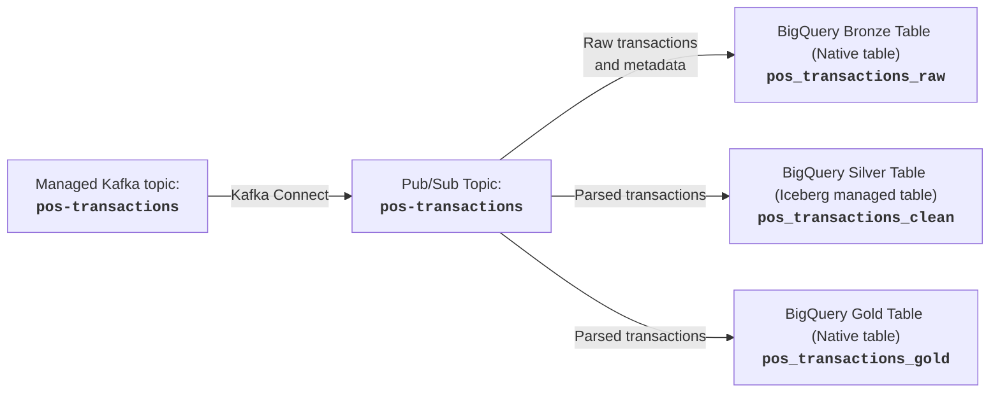
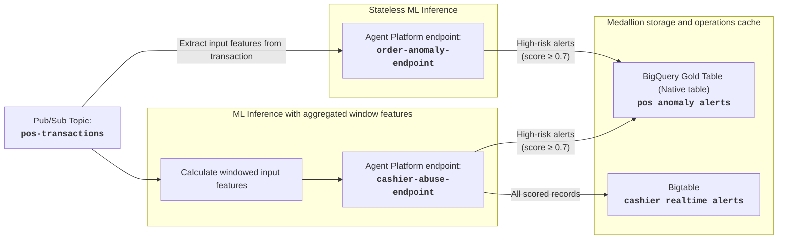
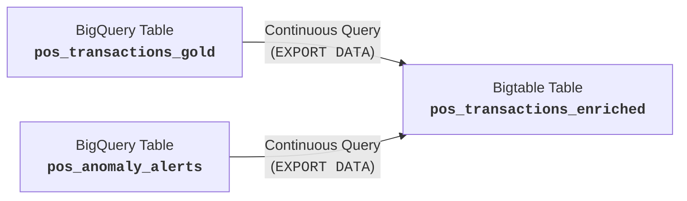

# Module 2 Lab Guide: Real-Time Stream Ingestion, ML Inference & Continuous Activation

---

## 📋 Pre-Flight Environment Context

Your landing zone has already been bootstrapped with baseline infrastructure on day 1:
- **VPC & Subnets:** `cymbal-retail-vpc` and `cymbal-retail-subnet-<region>`.
  - Private Google Access is enabled on the subnet.
  - Outbound internet access is configured via Cloud NAT `cymbal-retail-nat`.
- **BigQuery Datasets:** `cymbal_bronze`, `cymbal_silver`, `cymbal_gold`.
- **Bigtable Instance:** `operations-db`.
- **Managed Kafka:**
  - Cluster `kafka-cluster`.
  - Topic `pos-transactions`.
  - Connect cluster `kafka-connect-cluster`.
- **Agent Platform Endpoints:**
  - `order-anomaly-endpoint` with deployed order anomaly detection model.
  - `cashier-abuse-endpoint` with deployed cashier discount abuse detection model.
- **Service Account:** Dedicated service account `cymbal-sa-data` has been provisioned with IAM permissions and should be used wherever a service account is required across your data pipeline.
  - You should add additional IAM roles to this service account as part of your solution terraform code if needed. Use a separate `google_project_iam_member` resource to do so, **do not** modify `cymbal_sa_data_iam_roles` in `infra.tf` from day 1.

## 🛠️ Instructions

All hands-on work for module 2 should be done by adding on to the Terraform code provided in [streaming.tf](./streaming.tf) and [providers.tf](providers.tf). This Terraform code is designed to be applied on top of the infrastructure deployed in module 0 on day 1 and any hands-on work from module 1. You should not be making changes to any other existing files or Terraform code apart from [streaming.tf](./streaming.tf) and [providers.tf](providers.tf).

You may need to add the following providers as you progress through the hands-on exercises:
- `google-beta` is required for challenge 2.3 to manage BigQuery continuous query jobs.
- `hashicorp/random` if you need random IDs/suffixes to avoid naming conflicts.
- `hashicorp/time` if you need to work with time-based triggers or delays.

> [!WARNING]
> **Cost management:** The pipelines created in module 2 will incur high running cost and are likely to exceed the default monthly Argolis budget limit ($2,000 monthly). You should plan to deprovision module 2 resources after the week ends, keeping only the Terraform files for future reference.
> - Most of the cost will come from:
>   1. Bigtable, which will store every transaction once challenge 2.3 is completed.
>   2. BigQuery continuous queries, which are also created in challenge 2.3.

## Pre-requisites

- **An Argolis project**: Use the same project from module 0.
- **gcloud authentication**: Be authenticated to `gcloud` and have the `resourcemanager.projects.setIamPolicy` permission (e.g. from the `resourcemanager.projectIamAdmin` or `Owner` roles) on the project.
- **Terraform state storage**: Use the same Google Cloud Storage bucket from module 0.

---

### Step 1: Create local `terraform.tfvars`
> [!IMPORTANT]
> All steps must be run in the folder that contains this instructions file.

Make a copy of the `terraform.tfvars` file from day 1 to this directory. Alternatively, copy and rename [terraform.tfvars.sample](./terraform.tfvars.sample) and configure your `project_id` manually.

---

### Step 2: Initialize Terraform

Initialize the Terraform working directory. Since we are using a remote Cloud Storage bucket to store the state, you must specify the backend configuration dynamically using your project ID.
  
If you used a different bucket name on day 1, make sure you use that bucket name here.

```bash
# Replace <PROJECT_ID> with your actual Google Cloud Project ID.
terraform init -backend-config="bucket=<PROJECT_ID>-tfstate"
```

---

### Step 3: Run Terraform Apply

Perform an initial deployment to provision the streaming POS transaction generator.

```bash
terraform apply
```

Review the planned resources and confirm by typing `yes` when prompted.
> [!IMPORTANT]
> **Kafka Producer VM:** The `kafka-client` Compute Engine instance which continuously emits POS transactions to Kafka topic `pos-transactions` is provisioned by [`streaming.tf`](streaming.tf). You will not see messages in Kafka if you have not applied [`streaming.tf`](streaming.tf) for the first time.
>  
> SSH to the `kafka-client` VM via IAP is enabled, but you should never need to SSH into the VM.
>
> **Do not** delete or power off the VM after it is provisioned. This includes modifying its resource block in Terraform or manually editing the VM in the console.

---

## 🏷️ Part 1: Stream Ingestion & Medallion Storage



---

### Challenge 1.1: Managed Kafka to Pub/Sub Ingestion Bridge

#### 🎯 Objective
Bridge streaming transactions from the Managed Kafka topic `pos-transactions` in cluster `kafka-cluster` into Cloud Pub/Sub using a Managed Kafka Connect sink connector.

#### ⚙️ Requirements & Constraints
1. **Pub/Sub Topic:** Create a Pub/Sub topic `pos-transactions` to receive the raw Kafka stream.
2. **Managed Connector:** Create a managed connector deployed on the provided managed Connect cluster `kafka-connect-cluster`.

#### 💡 Hints
- **Checking if Kafka messages are produced:**
  - You can use the following command in your terminal or Cloud Shell to check if the Kafka producer is sending messages. If the producer is working, you should see multiple log lines similar to `Aug 27 05:47:00 kafka-client python3[7821]: Delivered a message to pos-transactions[0]`.
    ```bash
    gcloud compute ssh kafka-client --zone=us-central1-a --command="sudo journalctl -u retail-producer.service -n 20 --no-pager"
    ```
  - If you do not see these logs after waiting 5-10 minutes, you should delete and recreate the producer VM:
    ```bash
    terraform destroy -target=google_compute_instance.kafka_client -auto-approve
    terraform apply -auto-approve
    ```
- **Kafka Connect converters:** The incoming POS transactions are raw strings, use the `org.apache.kafka.connect.storage.StringConverter` converter.
- **Inspect Pub/Sub Messages:** Create a temporary pull subscription or use the Google Cloud Console / `gcloud pubsub subscriptions pull` to inspect raw message keys and payloads.

---

### Challenge 1.2: Medallion Ingestion into BigQuery (Bronze, Silver Iceberg Managed & Gold Native)

#### 🎯 Objective
Land streaming transactions from Pub/Sub into **Bronze** (raw audit storage), **Silver** (conformed Iceberg storage), and **Gold** (conformed native storage).

#### ⚙️ Requirements & Constraints
1. **Bronze layer `cymbal_bronze.pos_transactions_raw` (Native Table):**
    - Ingest and append raw messages to the table without any parsing.
    - Also store Pub/Sub metadata - refer to the [guidance schema](#raw-transactions-table) for the minimal list of required columns.
    - Partition by day on Pub/Sub publish time. Partitions do not expire.
2. **Silver layer `cymbal_silver.pos_transactions_clean` (Iceberg Managed Table):**
    - Ingest and parse transactions - match the [required schema](#clean-transactions-tables) **exactly**. 
      - Add a column `business_date` which is the date portion of `event_timestamp`.
      - Partition the table by day on this column. Partitions should expire after 7 days.
3. **Gold layer `cymbal_gold.pos_transactions_gold`(Native Table):** Same requirements as `cymbal_silver.pos_transactions_clean`, except as a native rather than Iceberg Managed table.
4. **Handle delivery failures:** Ensure messages which cannot be delivered (e.g. malformed, parsing issues) are separately stored along with Pub/Sub metadata in BigQuery native table `cymbal_bronze.dlq` for investigation and redelivery. 
    - Refer to the [guidance schema](#dead-letter-table) for the minimal list of required columns.
    - You **need not** implement a redelivery pipeline.

#### 💡 Hints
- **Sample Pub/Sub Payload:** Pub/Sub message payloads are simple strings with valid JSON formatting including escaping internal double-quotes:
  ```
  {"transaction_id": "TXN-20260903-0004398", "event_timestamp": "2026-09-03T17:39:24.164Z", "store_id": "STORE_041", "pos_terminal_id": "POS_06", "cashier_id": "CASH_1163", "customer_id": "CUST_37676", "customer_loyalty_tier": "PLATINUM", "payment_method": "CASH", "payment_network": "NA", "card_bin": "NA", "is_contactless": false, "currency": "USD", "item_count": 3, "total_quantity": 5, "subtotal_amount": 82.95, "discount": 0.0, "tax_amount": 6.64, "total": 89.59, "promo_code_applied": "NONE", "manual_discount_flag": false, "items": [{"line_seq": 1, "item_id": "prod_6114", "item_name": "JBL A352HI 350W 6 1/2\" Coaxial Speakers", "category": "Portable Speakers & Soundbars", "quantity": 1, "unit_price": 28.99, "total": 28.99, "discount": 0.0, "item_net_amount": 28.99}, {"line_seq": 2, "item_id": "prod_3446", "item_name": "(Renewed) MI Smart Band 4 , Black", "category": "Smartwatches & Wearables", "quantity": 3, "unit_price": 13.99, "total": 41.97, "discount": 0.0, "item_net_amount": 41.97}, {"line_seq": 3, "item_id": "prod_309", "item_name": "Apple Lightning to 3.5 mm Headphone Jack Adapter", "category": "Headphones & Wired Earphones", "quantity": 1, "unit_price": 11.99, "total": 11.99, "discount": 0.0, "item_net_amount": 11.99}]}
  ```
- **Disable Deletion Protection for BigQuery Tables:** You should explicitly disable deletion protection on BigQuery tables that you create in Terraform for purposes of this exercise. Newer Terraform Provider versions enable deletion protection on BigQuery tables by default, which is good in production but adds hassle in a learning environment.
- **Iceberg Managed Table Storage Access:** The BigQuery Cloud Resource Connection (`biglake-iceberg-connection`) and its project-level storage permissions have already been provisioned as part of the shared infrastructure in Module 0. In your Module 2 Terraform, you only need to reference this connection by its hardcoded path: `projects/<PROJECT_ID>/locations/<LOCATION>/connections/biglake-iceberg-connection`. You do not need to create the connection or grant GCS bucket roles in Module 2.
- **Handling delivery failure:** If you are using Pub/Sub subscriptions, note that the Pub/Sub service account needs [specific roles](https://docs.cloud.google.com/pubsub/docs/dead-letter-topics#grant_forwarding_permissions) to use dead-letter topics.
- **Roles required for custom service accounts:** The Pub/Sub managed service agent **does not** need additional roles to specify the dedicated service account `cymbal-sa-data` for use with subscriptions. However, the user calling Terraform (i.e. your user account) does need service account roles, which should have been added as part of the base infrastructure setup and preparation.

---

## 🏷️ Part 2: Streaming ML Inference & Operational Activation



---

### Challenge 2.1: Real-Time ML Inference With Stateless Input Features

#### 🎯 Objective
Run real-time order anomaly detection on the incoming stream and write anomaly alerts directly to BigQuery table `cymbal_gold.pos_anomaly_alerts`.

#### ⚙️ Requirements & Constraints
1. **Consolidated alert table:**
    - All flagged transactions from both models are stored in a single table `cymbal_gold.pos_anomaly_alerts` which should match the [required schema](#anomaly-alerts-table) **exactly**.
    - The following columns in the alert table require you to populate the data as part of your inference pipeline:
      - `alert_id` should have a prefix `ALT-ANOMALY-` or `ALT-ABUSE-` and a meaningful suffix - no two alerts should have the same `alert_id`.
      - `alert_type` should identify the alert flag type i.e. `order_anomaly` or `cashier_promo_abuse`.
      - `alert_source` should identify the model which originated the alert, i.e. `order_anomaly_model` or `cashier_abuse_model`.
    - Cluster the table on `store_id` and `alert_type`.
    - Partition the table on `alert_ts`. Partitions should expire after 90 days.
2. **Target Endpoint:** Use the pre-deployed Agent Platform endpoint `order-anomaly-endpoint`.
3. **Extract Features:** Provide the [required input features](#order-anomaly-detection) to the target endpoint by extracting the relevant fields from the incoming transaction payload. 
4. **Write Alerts:** Write only high-risk alerts (predicted label value=1 and score ≥ 0.7) to the alerts table `cymbal_gold.pos_anomaly_alerts`.

#### 💡 Hints
- **Explore endpoint output:** Use the `endpoints.predict` API to explore the endpoint output, for example:
  ```bash
  curl -X POST \
  -H "Authorization: Bearer $(gcloud auth print-access-token)" \
  -H "Content-Type: application/json" \
  "https://<REGION>-aiplatform.googleapis.com/v1/projects/<PROJECT>/locations/<REGION>/endpoints/order-anomaly-endpoint:predict" \
  -d '{
    "instances": [
      {
        "customer_loyalty_tier": "NONE",
        "item_count": "1",
        "total_item_quantity": "1",
        "subtotal_amount": "27.9",
        "discount_amount": "0.0",
        "tax_amount": "2.23",
        "total_amount": "30.13"
      }
    ],
    "parameters": {}}'
  ```
- **Risk score:** Do not expect `label_<MODEL>_probs[0]` to always contain the value you need for `risk_score`. The order of elements in `label_<MODEL>_probs[]` and `label_<MODEL>_values[]` depends on the predicted class in `predicted_label_<MODEL>`. You should have your pipeline check the values of each element in `label_<MODEL>_values[]` to determine the value of `risk_score`.
- **Use Pub/Sub message attributes:** The Pub/Sub AI Inference SMT has [strict requirements](https://docs.cloud.google.com/pubsub/docs/smts/ai-inference-smt#input) on the input message data to match the model endpoint request structure. If you need to retain message fields that are not allowed in the model endpoint request for use in subsequent transformation steps, you can store them in the message attributes to "pass-along" the data to subsequent transformation steps.
- **Permissions for Agent Platform:** The dedicated service account `cymbal-sa-data` needs additional roles to call Agent Platform endpoints. You must provision these in a `google_project_iam_member` resource before attempting to provision the inference pipeline (using Terraform `depends`), otherwise the inference pipeline will fail to deploy.
  - Similar to challenge 1.2, the Pub/Sub managed service agent **does not** need additional roles to complete this challenge.
- **Invoking Agent Platform Endpoints:** The deployed endpoints can be invoked using the resource name format `projects/<PROJECT_ID>/locations/<REGION>/endpoints/<ENDPOINT_NAME>`. `<ENDPOINT_NAME>` can be retrieved from variables `var.order_anomaly_endpoint_name` and `var.cashier_abuse_endpoint_name`.

---

### Challenge 2.2: Real-Time ML Inference With Windowed Input Features

#### 🎯 Objective
Run real-time cashier discount abuse detection on the incoming stream and write alerts directly to BigQuery table `cymbal_gold.pos_anomaly_alerts`. Also write all scored transactions to Bigtable `operations-db:cashier_realtime_alerts`.

#### ⚙️ Requirements & Constraints
1. **Target Endpoint:** Use the pre-deployed Agent Platform endpoint `cashier-abuse-endpoint`.
2. **Stateful Feature Aggregation:** The [required input features](#cashier-discount-abuse-detection) include 6 windowed input features `cashier_1h_...` which need to be calculated over a moving 1-hour window per cashier each time a new transaction is received. These calculated features plus the four remaining features from the transaction payload must then be sent to the target endpoint for inference.
3. **Dual-Sink Routing:**
   - **Bigtable Sink:** Write every transaction's score and the associated windowed input features into a Bigtable table (`cashier_realtime_alerts`) following the [required schema](#cashier-statistics) and row key structure.
     - `audit_status` is set to `review` if the risk score is ≥ 0.7, otherwise it is set to `clear`.
   - **BigQuery Sink:** Write only high-risk alerts (predicted label value=1 and score ≥ 0.7) to the alerts table `cymbal_gold.pos_anomaly_alerts` created in Challenge 2.1.
4. **Separate Pipeline Code:**
    - Define the pipeline in a separate file in the language of your choice. This pipeline definition file must be submitted together with your Terraform file `streaming.tf` for review and feedback.
    - If the pipeline needs to be compiled/staged before deployment, you may perform the compilation and staging outside Terraform. However, you should create any resources needed to support the pipeline compile/staging/run (e.g. GCS buckets) in Terraform.
    - Similarly, the deployment of the pipeline itself should be done in Terraform.

#### 💡 Hints
- **Using Dataflow with Pub/Sub:** If you choose to use Dataflow for this pipeline, note that [some features of Pub/Sub are not supported](https://docs.cloud.google.com/dataflow/docs/concepts/streaming-with-cloud-pubsub#unsupported-features) in the Dataflow runner's implementation of the Pub/Sub I/O connector.
  - In particular, you should plan to robustly handle failure at any point in the pipeline, passing the failed message in its original form to the dead letter topic or table for future reprocessing. Do not rely on Pub/Sub dead lettering for this pipeline.
  - This also means the pipeline service account should have necessary roles to write the dead letter message to the dead letter topic or table.
- **Dataflow requirements:** there are two distinct sets of requirements to work with Dataflow code:
    - Requirements for the Dataflow pipeline itself, which should be provided to Dataflow as a `requirements.txt` requirements file. Your pipeline should require at least `google-cloud-bigtable` and `google-cloud-aiplatform` packages. `apache-beam[gcp]` is not required as Dataflow workers will have it pre-installed.
    - Requirements to stage the code: you should use a Python venv to stage the code. The venv will require `apache-beam[gcp]` but not `google-cloud-bigtable` and `google-cloud-aiplatform`.
- **Querying Bigtable:** If you need to use SQL in Bigtable Studio to query the table, remember to use the [conversion functions](https://docs.cloud.google.com/bigquery/docs/reference/standard-sql/conversion_functions) to make the results readable.
  - See also the documentation on [Bytes in GoogleSQL for Bigtable](https://docs.cloud.google.com/bigtable/docs/googlesql-overview#bytes).
  ```sql
  SELECT
    SPLIT(_key, '#')[SAFE_OFFSET(0)] AS store_id
    , SPLIT(_key, '#')[SAFE_OFFSET(1)] AS cashier_id
    , TO_INT64(stats['cashier_1h_txn_count']) AS cashier_1h_txn_count
    , TO_INT64(stats['cashier_1h_promo_count']) AS cashier_1h_promo_count
    , TO_FLOAT64(stats['cashier_1h_promo_rate']) AS cashier_1h_promo_rate
    , TO_INT64(stats['cashier_1h_manual_override_count']) AS cashier_1h_manual_override_count
    , TO_FLOAT64(stats['cashier_1h_total_discount_usd']) AS cashier_1h_total_discount_usd
    , TO_FLOAT64(stats['cashier_1h_avg_discount_pct']) AS cashier_1h_avg_discount_pct
    , TO_FLOAT64(stats['risk_score']) AS risk_score
    ,stats['last_event_ts'] AS last_event_ts
    ,flags['audit_status'] AS audit_status
  FROM `cashier_realtime_alerts`(WITH_HISTORY=>FALSE)
  LIMIT 100;
  ```

---

### Challenge 2.3: Operational Activation (Reverse ETL) Using BigQuery Continuous Queries



#### 🎯 Objective
Continuously export conformed transactions and anomaly alerts from BigQuery tables into Cloud Bigtable `operations-db:pos_transactions_enriched` using BigQuery Continuous Queries for operational low-latency lookup.

#### ⚙️ Requirements & Constraints
1. **BigQuery Edition Reservation:** Create an **Enterprise Edition** slot reservation and configure an assignment with job type `CONTINUOUS`. To minimize cost, configure the reservation with zero baseline slots and a small (100-200) number of maximum slots.
2. **Bigtable Schema:** The schema of `pos_transactions_enriched` must match the [required schema](#enriched-transactions) **exactly**.

#### 💡 Hints
- **Suitable BigQuery Tables:** Your continuous queries should read from `pos_transactions_gold` and `pos_anomaly_alerts` BigQuery tables.
  - `pos_transactions_raw` can be used in place of `pos_transactions_gold`, but this requires you to repeat parsing logic that has already been applied in the streaming pipeline and is generally not recommended.
  - `pos_transactions_clean` is [not supported for Continuous Queries](https://docs.cloud.google.com/bigquery/docs/continuous-queries-introduction).
- **Bigtable Sparse Tables And `NULL` Behaviour:** Bigtable's [flexible data model](https://docs.cloud.google.com/bigtable/docs/googlesql-overview#sparse-tables) means that only cells with data are stored, and that `NULL` values are not stored. Remember that we have two different alert types from two independent inference pipelines, which can create race conditions on the Bigtable table if you naively export `NULL` fields from the alerts table in BigQuery.
  - Instead, use a `CASE` statement to dynamically construct a `JSON_OBJECT` as the `alerts` column containing only fields for the active model based on `alert_type`.
- **`EXPORT DATA` Requirements:** Review the [documentation](https://docs.cloud.google.com/bigquery/docs/export-to-bigtable), particularly the sections covering limitations and preparing query results for export. You will need to provision some resources that are intentionally not explicitly called out in the requirements section above.
- **Terraform needs unique job IDs on every apply:** The `google_bigquery_job` resource in Terraform must use a new `job_id` if it needs to be re-created (e.g. job failure due to transient issues or waiting for slot reservation to propagate).
  - If you create the Continuous Query reservation and assignment and query jobs in quick succession, the jobs may fail because the assignment is not ready. Consider adding a 60 second delay after creating the assignment and before creating the query jobs.
  - You cannot reuse a `job_id`. If your continuous query job fails for any reason and you need to recreate it using Terraform, you must change the `job_id`. One easy way to work around this is to append a timestamp to your `job_id` using the `time_static` resource. To recreate your continuous query job, simply destroy the `time_static` resource (`terraform destroy -target=time_static.<RESOURCE_NAME>`) and run `terraform apply` again.
  - With the `google_bigquery_job` resource, Terraform will only create jobs and will not cancel the created jobs upon destroy. You will need to manually cancel the job, or run `terraform destroy` to destroy the continuous query reservation and assignment, which will cause **all** continuous queries to fail.

---

## Final Verification

After you have completed all the challenges, perform the steps below to ensure that all data required for following labs is present and correct. You should wait around 10 minutes after finishing the final challenge to allow data to propagate through the pipeline.

### BigQuery Tables

Check that each of the tables has correctly populated with data similar to the samples provided.
```bash
export PROJECT_ID="<PROJECT_ID>"

bq query --use_legacy_sql=false --project_id=${PROJECT_ID} \
  "SELECT * FROM \`${PROJECT_ID}.cymbal_gold.pos_transactions_gold\` LIMIT 5"
bq query --use_legacy_sql=false --project_id=${PROJECT_ID} \
  "SELECT * FROM \`${PROJECT_ID}.cymbal_gold.pos_anomaly_alerts\` LIMIT 5"
```


#### Clean Transactions Table
`cymbal_gold.pos_transactions_gold`

**Sample Result**

| transaction_id | event_timestamp | business_date | store_id | pos_terminal_id | cashier_id | customer_id | customer_loyalty_tier | payment_method | payment_network | card_bin | is_contactless | currency | item_count | total_quantity | subtotal_amount | discount | tax_amount | total | promo_code_applied | manual_discount_flag | items |
| :--- | :--- | :--- | :--- | :--- | :--- | :--- | :--- | :--- | :--- | :--- | :--- | :--- | :--- | :--- | :--- | :--- | :--- | :--- | :--- | :--- | :--- |
| TXN-20260906-0220917 | 2026-09-06 23:52:22.789000 UTC | 2026-09-06 | STORE_028 | POS_07 | CASH_1109 | CUST_13421 | SILVER | CREDIT_CARD | DISCOVER | 594780 | true | USD | 2 | 2 | 54.98 | 0 | 4.4 | 59.38 | NONE | false | {"items": [{"line_seq": "1", "item_id": "prod_2209", "item_name": "boAt BassHeads 900 On-Ear Wired Headphone with Mic", "category": "Headphones \u0026 Wired Earphones", "quantity": "1", "unit_price": "10.99", "total": "10.99", "discount": "0", "item_net_amount": "10.99"}, {"line_seq": "2", "item_id": "prod_546", "item_name": "Oppo Enco Air 2 Pro Bluetooth Truly Wireless in Ear Earbuds with Mic - White", "category": "True Wireless Earbuds", "quantity": "1", "unit_price": "43.99", "total": "43.99", "discount": "0", "item_net_amount": "43.99"}]} |
| TXN-20260906-0220918 | 2026-09-06 23:52:24.502000 UTC | 2026-09-06 | STORE_033 | POS_01 | CASH_1131 | CUST_39748 | BRONZE | CREDIT_CARD | VISA | 583672 | false | USD | 2 | 2 | 768.98 | 0 | 61.52 | 830.5 | NONE | false | {"items": [{"line_seq": "1", "item_id": "prod_546", "item_name": "Oppo Enco Air 2 Pro Bluetooth Truly Wireless in Ear Earbuds with Mic - White", "category": "True Wireless Earbuds", "quantity": "1", "unit_price": "43.99", "total": "43.99", "discount": "0", "item_net_amount": "43.99"}, {"line_seq": "2", "item_id": "prod_8279", "item_name": "Canon M50 Mark II 15-45mm f3.5-6.3 is STM", "category": "Power \u0026 Accessories", "quantity": "1", "unit_price": "724.99", "total": "724.99", "discount": "0", "item_net_amount": "724.99"}]} |
| TXN-20260906-0220919 | 2026-09-06 23:52:26.756000 UTC | 2026-09-06 | STORE_031 | POS_04 | CASH_1122 | CUST_44752 | NONE | CASH | NA | NA | false | USD | 2 | 3 | 48.97 | 0 | 3.92 | 52.89 | NONE | false | {"items": [{"line_seq": "1", "item_id": "prod_8930", "item_name": "Techno Simba Buds - Bluetooth Wireless Earphones", "category": "True Wireless Earbuds", "quantity": "1", "unit_price": "24.99", "total": "24.99", "discount": "0", "item_net_amount": "24.99"}, {"line_seq": "2", "item_id": "prod_309", "item_name": "Apple Lightning to 3.5 mm Headphone Jack Adapter", "category": "Headphones \u0026 Wired Earphones", "quantity": "2", "unit_price": "11.99", "total": "23.98", "discount": "0", "item_net_amount": "23.98"}]} |
| TXN-20260906-0220920 | 2026-09-06 23:52:27.643000 UTC | 2026-09-06 | STORE_033 | POS_08 | CASH_1131 | CUST_49685 | PLATINUM | GIFT_CARD | NA | 888888 | false | USD | 1 | 2 | 73.98 | 11.1 | 5.03 | 67.91 | WELCOME15 | false | {"items": [{"line_seq": "1", "item_id": "prod_5839", "item_name": "Apple Watch Magnetic Charging Cable (1 m)", "category": "Smartwatches \u0026 Wearables", "quantity": "2", "unit_price": "36.99", "total": "73.98", "discount": "11.1", "item_net_amount": "62.88"}]} |
| TXN-20260906-0220921 | 2026-09-06 23:52:29.908000 UTC | 2026-09-06 | STORE_003 | POS_04 | CASH_1011 | GUEST | NONE | MOBILE_PAY | VISA | 576331 | false | USD | 1 | 1 | 6.24 | 0 | 0.5 | 6.74 | NONE | false | {"items": [{"line_seq": "1", "item_id": "prod_6727", "item_name": "AmazonBasics 14-Gauge Speaker wire - 50 feet", "category": "Portable Speakers \u0026 Soundbars", "quantity": "1", "unit_price": "6.24", "total": "6.24", "discount": "0", "item_net_amount": "6.24"}]} |

#### Anomalies Table
`cymbal_gold.pos_anomaly_alerts`

**Sample Result**

| alert_id | store_id | alert_type | alert_source | transaction_id | cashier_id | discount_pct | risk_score | alert_ts |
| :--- | :--- | :--- | :--- | :--- | :--- | :--- | :--- | :--- |
| ALT-ABUSE-1788747672002 | STORE_009 | cashier_promo_abuse | cashier_abuse_model | TXN-20260907-0227797 | CASH_1036 | 0.66048862679022746 | 0.99998664855957031 | 2026-09-07 02:21:12.002000 UTC |
| ALT-ABUSE-1788747672344 | STORE_009 | cashier_promo_abuse | cashier_abuse_model | TXN-20260907-0227798 | CASH_1036 | 0.60032779208616249 | 0.99998664855957031 | 2026-09-07 02:21:12.344000 UTC |
| ALT-ABUSE-1788747674007 | STORE_009 | cashier_promo_abuse | cashier_abuse_model | TXN-20260907-0227799 | CASH_1036 | 0.78387390118217637 | 0.99998664855957031 | 2026-09-07 02:21:14.007000 UTC |
| ALT-ABUSE-1788739102361 | STORE_041 | cashier_promo_abuse | cashier_abuse_model | TXN-20260906-0221184 | CASH_1164 | 0.76939793373708587 | 0.99998664855957031 | 2026-09-06 23:58:22.361000 UTC |
| ALT-ABUSE-1788739102920 | STORE_041 | cashier_promo_abuse | cashier_abuse_model | TXN-20260906-0221185 | CASH_1164 | 0.77373389955427652 | 0.99998664855957031 | 2026-09-06 23:58:22.920000 UTC |

### Bigtable Tables
Run the following queries in [Bigtable Studio](https://console.cloud.google.com/bigtable/instances/operations-db/studio/query).

#### Cashier Statistics
`operations-db:cashier_realtime_alerts`
```sql
SELECT
  _key,
  TO_INT64(stats['cashier_1h_txn_count']) AS cashier_1h_txn_count,
  TO_INT64(stats['cashier_1h_promo_count']) AS cashier_1h_promo_count,
  TO_FLOAT64(stats['cashier_1h_promo_rate']) AS cashier_1h_promo_rate,
  TO_INT64(stats['cashier_1h_manual_override_count']) AS cashier_1h_manual_override_count,
  TO_FLOAT64(stats['cashier_1h_total_discount_usd']) AS cashier_1h_total_discount_usd,
  TO_FLOAT64(stats['cashier_1h_avg_discount_pct']) AS cashier_1h_avg_discount_pct,
  TO_FLOAT64(stats['risk_score']) AS risk_score,
  stats['last_event_ts'] AS last_event_ts,
  flags['audit_status'] AS audit_status
FROM
  `cashier_realtime_alerts`(WITH_HISTORY => FALSE)
WHERE
  flags['audit_status'] IN ('clear', 'review')
LIMIT 5;
```

If you only see rows with one `audit_status` e.g. `clear`, you can modify the `WHERE` clause of the query e.g. to only retrieve `review` rows.

#### Sample Result:

| `_key` | `cashier_1h_txn_count` | `cashier_1h_promo_count` | `cashier_1h_promo_rate` | `cashier_1h_manual_override_count` | `cashier_1h_total_discount_usd` | `cashier_1h_avg_discount_pct` | `risk_score` | `last_event_ts` | `audit_status` |
| :--- | :--- | :--- | :--- | :--- | :--- | :--- | :--- | :--- | :--- |
| `STORE_018#CASH_1071#9221583296621055807` | `1` | `1` | `1` | `1` | `109.11` | `76.00306492059069` | `0.9999866485595703` | `2026-09-07T00:17:13.720Z` | `review` |
| `STORE_018#CASH_1071#9221583296623334807` | `1` | `1` | `1` | `1` | `50.96` | `74.29654468581425` | `0.9999866485595703` | `2026-09-07T00:17:11.441Z` | `review` |
| `STORE_001#CASH_1001#9221583288137764807` | `1` | `0` | `0` | `0` | `0` | `0` | `0.000002726150341914035` | `2026-09-07T02:38:37.011Z` | `clear` |
| `STORE_001#CASH_1001#9221583288171211807` | `1` | `0` | `0` | `0` | `0` | `0` | `0.000002726150341914035` | `2026-09-07T02:38:03.564Z` | `clear` |
| `STORE_001#CASH_1001#9221583288696671807` | `1` | `1` | `1` | `0` | `47.94` | `15.000938732085864` | `0.000002726150341914035` | `2026-09-07T02:29:18.104Z` | `clear` |

#### Enriched Transactions
`operations-db:pos_transactions_enriched`
```sql
SELECT
  _key,
  tx['transaction_id'] transaction_id,
  tx['event_timestamp'] event_timestamp,
  tx['cashier_id'] cashier_id,
  tx['promo_code_applied'] promo_code_applied,
  tx['manual_discount_flag'] = b'\x01' manual_discount_flag,
  alerts['is_order_anomaly'] is_order_anomaly,
  alerts['order_anomaly_risk_score'] order_anomaly_risk_score,
  alerts['is_cashier_promo_abuse'] is_cashier_promo_abuse,
  alerts['cashier_promo_abuse_risk_score'] cashier_promo_abuse_risk_score
FROM
  `pos_transactions_enriched`
WHERE
  TIMESTAMP(CAST(tx['event_timestamp'] AS STRING)) >= TIMESTAMP_SUB(CURRENT_TIMESTAMP(), INTERVAL 10 MINUTE)
  AND (
    alerts['is_cashier_promo_abuse'] = '1'
    OR alerts['is_order_anomaly'] = '1'
  );
```

You should see rows with all columns populated (i.e. no `null` values) except for one of the column pairs below. One of the column pairs will always be `null` depending on which fraud type was flagged.
- `is_order_anomaly` and `order_anomaly_risk_score`
- `is_cashier_promo_abuse` and `cashier_promo_abuse_risk_score`

#### Sample Result:

| `_key` | `transaction_id` | `event_timestamp` | `cashier_id` | `promo_code_applied` | `manual_discount_flag` | `is_order_anomaly` | `order_anomaly_risk_score` | `is_cashier_promo_abuse` | `cashier_promo_abuse_risk_score` |
| :--- | :--- | :--- | :--- | :--- | :--- | :--- | :--- | :--- | :--- |
| `STORE_037#TXN-20260831-0000244` | `TXN-20260831-0000244` | `2026-08-31T06:25:37.012Z` | `CASH_1147` | `NONE` | `false` | `1` | `0.9996265172958374` | | |
| `STORE_039#TXN-20260831-0000140` | `TXN-20260831-0000140` | `2026-08-31T06:23:27.655Z` | `CASH_1153` | `NONE` | `false` | `1` | `0.9989064931869507` | | |
| `STORE_040#TXN-20260831-0000158` | `TXN-20260831-0000158` | `2026-08-31T06:23:48.19Z` | `CASH_1159` | `NONE` | `false` | `1` | `0.7635790705680847` | | |
| `STORE_041#TXN-20260831-0000236` | `TXN-20260831-0000236` | `2026-08-31T06:25:28.574Z` | `CASH_1164` | `MANUAL_OVERRIDE` | `true` | | | `1` | `0.9999866485595703` |
| `STORE_041#TXN-20260831-0000237` | `TXN-20260831-0000237` | `2026-08-31T06:25:29.644Z` | `CASH_1164` | `MANUAL_OVERRIDE` | `true` | | | `1` | `0.9999866485595703` |

---

## 📚 Appendix

### BigQuery Schemas

#### Raw Transactions Table
`cymbal_bronze.pos_transactions_raw`
  
**Note:** You may add additional columns if required - the table must have at least these three columns.

| Column Name | Data Type | Constraints & Source/Calculation |
| :--- | :--- | :--- |
| `publish_time` | TIMESTAMP | Pub/Sub metadata. Partitioning key. |
| `attributes` | JSON | Pub/Sub metadata. |
| `data` | STRING | Pub/Sub message payload. |

#### Dead Letter Table
`cymbal_bronze.dlq`

**Note:** You may add additional columns if required - the table must have at least these three columns.


| Column Name | Data Type |
| :--- | :--- |
| `publish_time` | TIMESTAMP |
| `attributes` | JSON |
| `data` | STRING |

#### Clean Transactions Tables
`cymbal_silver.pos_transactions_clean` and `cymbal_gold.pos_transactions_gold`

| Column Name | Data Type | Constraints & Source/Calculation |
| :--- | :--- | :--- |
| `transaction_id` | STRING | Extract from original Kafka payload. |
| `event_timestamp` | TIMESTAMP | Extract from original Kafka payload. |
| `business_date` | DATE | **Calculated**: date portion of `event_timestamp`.<br>**Partitioning key, expire after 7 days.** |
| `store_id` | STRING | Extract from original Kafka payload. |
| `pos_terminal_id` | STRING | Extract from original Kafka payload. |
| `cashier_id` | STRING | Extract from original Kafka payload. |
| `customer_id` | STRING | Extract from original Kafka payload. |
| `customer_loyalty_tier` | STRING | Extract from original Kafka payload. |
| `payment_method` | STRING | Extract from original Kafka payload. |
| `payment_network` | STRING | Extract from original Kafka payload. |
| `card_bin` | STRING | Extract from original Kafka payload. |
| `is_contactless` | BOOLEAN | Extract from original Kafka payload. |
| `currency` | STRING | Extract from original Kafka payload. |
| `item_count` | INTEGER | Extract from original Kafka payload. |
| `total_quantity` | INTEGER | Extract from original Kafka payload. |
| `subtotal_amount` | NUMERIC | Extract from original Kafka payload. |
| `discount` | NUMERIC | Extract from original Kafka payload. |
| `tax_amount` | NUMERIC | Extract from original Kafka payload. |
| `total` | NUMERIC | Extract from original Kafka payload. |
| `promo_code_applied` | STRING | Extract from original Kafka payload. |
| `manual_discount_flag` | BOOLEAN | Extract from original Kafka payload. |
| `items` | RECORD (REPEATED) | Extract from original Kafka payload. |
| `items.line_seq` | INTEGER | Extract from original Kafka payload. |
| `items.item_id` | STRING | Extract from original Kafka payload. |
| `items.item_name` | STRING | Extract from original Kafka payload. |
| `items.category` | STRING | Extract from original Kafka payload. |
| `items.quantity` | INTEGER | Extract from original Kafka payload. |
| `items.unit_price` | NUMERIC | Extract from original Kafka payload. |
| `items.total` | NUMERIC | Extract from original Kafka payload. |
| `items.discount` | NUMERIC | Extract from original Kafka payload. |
| `items.item_net_amount` | NUMERIC | Extract from original Kafka payload. |

#### Anomaly Alerts Table
`cymbal_gold.pos_anomaly_alerts`

| Column Name | Data Type | Constraints & Source/Calculation |
| :--- | :--- | :--- |
| `alert_id` | STRING | **Added by inference pipelines. Accepted format** `ALT-ANOMALY-<suffix>` or `ALT-ABUSE-<suffix>`. <br>**Must be unique.** |
| `store_id` | STRING | Preserved from original Kafka payload.<br>**Clustering key.** |
| `alert_type` | STRING | **Added by inference pipelines. Accepted values**: `order_anomaly`, `cashier_promo_abuse`.<br>**Clustering key.** |
| `alert_source` | STRING | **Added by inference pipelines. Accepted values**: `order_anomaly_model`, `cashier_abuse_model`. |
| `transaction_id` | STRING | Preserved from original Kafka payload. |
| `cashier_id` | STRING | Preserved from original Kafka payload. |
| `discount_pct` | FLOAT | **Calculated by inference pipelines:** `discount / subtotal_amount` with safe division, default to 0.0. |
| `risk_score` | FLOAT | **Added by inference pipelines:** Inference risk score/probability for the positive (anomaly or abuse) case.<br>**Constraint:** only alerts with score ≥ 0.7 should be stored in this table. |
| `alert_ts` | TIMESTAMP | Preserved from original Kafka payload. `event_timestamp` of the transaction that triggered the alert.<br>**Partitioning key, expire after 90 days.** |

---

### Bigtable Schemas

#### Cashier Statistics
`operations-db:cashier_realtime_alerts`

**Row Key**: `store_id`#`cashier_id`#`reverse_timestamp`
- Where `reverse_timestamp` = `9223372036854775807 - event_timestamp_micros`, zero-padded to 19 digits
- **Note:** the transaction `event_timestamp` is not originally in microseconds granularity and needs to be converted to calculate `reverse_timestamp`.

| Column Family | Column Qualifier | Data Type | Description / Source / Calculation |
| :--- | :--- | :--- | :--- |
| `stats` | `cashier_1h_txn_count` | INT64 | **Calculated by inference pipeline:** rolling 1-hour transaction count (all transactions) for specific `cashier_id`. |
| `stats` | `cashier_1h_promo_count` | INT64 | **Calculated by inference pipeline:** rolling 1-hour count of transactions with discount > 0 for specific `cashier_id`. |
| `stats` | `cashier_1h_promo_rate` | FLOAT64 | **Calculated by inference pipeline**: `cashier_1h_promo_count / cashier_1h_txn_count`. |
| `stats` | `cashier_1h_manual_override_count` | INT64 | **Calculated by inference pipeline:** rolling 1-hour count of transactions with `manual_discount_flag == true` for specific `cashier_id`. |
| `stats` | `cashier_1h_total_discount_usd` | FLOAT64 | **Calculated by inference pipeline:** rolling 1-hour sum of discount values (USD) granted by specific `cashier_id`. |
| `stats` | `cashier_1h_avg_discount_pct` | FLOAT64 | **Calculated by inference pipeline**: `(cashier_1h_total_discount_usd / cashier_1h_subtotal_amount) * 100.0` for specific `cashier_id`.<br>**Note:** `cashier_1h_subtotal_amount` is the sum of `subtotal_amount` for all transactions in the rolling 1-hour window. It is not written to the table but has to be calculated in the pipeline to derive this column. |
| `stats` | `risk_score` | FLOAT64 | **Added by inference pipeline:** Inference risk score/probability for the positive (cashier promo abuse) case. |
| `stats` | `last_event_ts` | STRING | Preserved from original Kafka payload. `event_timestamp` of the transaction that triggered the alert. |
| `flags` | `audit_status` | STRING | **Added by inference pipeline:** `review` (if risk_score ≥ 0.7), `clear` (otherwise). |

#### Enriched Transactions
`operations-db:pos_transactions_enriched`

**Row Key**: `store_id`#`transaction_id`

| Column Family | Column Qualifier | Data Type | Description / Source / Calculation |
| :--- | :--- | :--- | :--- |
| `tx` | `transaction_id` | STRING | Preserved from original Kafka payload. |
| `tx` | `event_timestamp` | STRING | Preserved from original Kafka payload. |
| `tx` | `business_date` | STRING | **Calculated**: date portion of `event_timestamp`. |
| `tx` | `store_id` | STRING | Preserved from original Kafka payload. |
| `tx` | `pos_terminal_id` | STRING | Preserved from original Kafka payload. |
| `tx` | `cashier_id` | STRING | Preserved from original Kafka payload. |
| `tx` | `customer_id` | STRING | Preserved from original Kafka payload. |
| `tx` | `customer_loyalty_tier` | STRING | Preserved from original Kafka payload. |
| `tx` | `payment_method` | STRING | Preserved from original Kafka payload. |
| `tx` | `payment_network` | STRING | Preserved from original Kafka payload. |
| `tx` | `card_bin` | STRING | Preserved from original Kafka payload. |
| `tx` | `is_contactless` | BOOLEAN | Preserved from original Kafka payload. |
| `tx` | `currency` | STRING | Preserved from original Kafka payload. |
| `tx` | `item_count` | INT64 | Preserved from original Kafka payload. |
| `tx` | `total_quantity` | INT64 | Preserved from original Kafka payload. |
| `tx` | `subtotal_amount` | FLOAT64 | Preserved from original Kafka payload. |
| `tx` | `discount` | FLOAT64 | Preserved from original Kafka payload. |
| `tx` | `tax_amount` | FLOAT64 | Preserved from original Kafka payload. |
| `tx` | `total` | FLOAT64 | Preserved from original Kafka payload. |
| `tx` | `promo_code_applied` | STRING | Preserved from original Kafka payload. |
| `tx` | `manual_discount_flag` | BOOLEAN | Preserved from original Kafka payload. |
| `tx` | `items` | STRING | Preserved from original Kafka payload. |
| `alerts` | `is_order_anomaly` | INT64 | **Added by activation pipeline:** `1` if order anomaly alert is triggered on the transaction. |
| `alerts` | `order_anomaly_alert_id` | STRING | Alert ID of the order anomaly alert. |
| `alerts` | `order_anomaly_alert_source` | STRING | Source of alert (`order_anomaly_model`). |
| `alerts` | `order_anomaly_risk_score` | FLOAT64 | Model risk score. |
| `alerts` | `order_anomaly_alert_ts` | STRING | Transaction event timestamp string. |
| `alerts` | `is_cashier_promo_abuse` | INT64 | **Added by activation pipeline:** `1` if cashier promo abuse alert is triggered on the transaction. |
| `alerts` | `cashier_promo_abuse_alert_id` | STRING | Alert ID of the cashier promo abuse alert. |
| `alerts` | `cashier_promo_abuse_alert_source` | STRING | Source of alert (`cashier_abuse_model`). |
| `alerts` | `cashier_promo_abuse_risk_score` | FLOAT64 | Model risk score. |
| `alerts` | `cashier_promo_abuse_alert_ts` | STRING | Transaction event timestamp string. |

---

### Model Input Features

#### Order Anomaly Detection
`order-anomaly-endpoint`

| Feature Name | Data Type | Source / Calculation |
| :--- | :--- | :--- |
| `customer_loyalty_tier` | STRING | `customer_loyalty_tier` from transaction |
| `item_count` | INTEGER | `item_count` from transaction |
| `total_item_quantity` | INTEGER | `total_quantity` from transaction |
| `subtotal_amount` | FLOAT | `subtotal_amount` from transaction |
| `discount_amount` | FLOAT | `discount` from transaction |
| `tax_amount` | FLOAT | `tax_amount` from transaction |
| `total_amount` | FLOAT | `total` from transaction |

#### Cashier Discount Abuse Detection
`cashier-abuse-endpoint`

| Feature Name | Data Type | Source / Calculation |
| :--- | :--- | :--- |
| `cashier_1h_txn_count` | INTEGER | Rolling 1-hour total transaction count for cashier |
| `cashier_1h_promo_count` | INTEGER | Rolling 1-hour count of transactions where discount > 0 |
| `cashier_1h_promo_rate` | FLOAT | Rolling 1-hour promo rate (`promo_count / txn_count`) |
| `cashier_1h_manual_override_count` | INTEGER | Rolling 1-hour count of transactions with `manual_discount_flag == true` |
| `cashier_1h_total_discount_usd` | FLOAT | Rolling 1-hour sum of discounts granted by cashier |
| `cashier_1h_avg_discount_pct` | FLOAT | Rolling 1-hour average discount percentage (`(total_discount / total_sales) * 100`) |
| `promo_code_applied` | STRING | `promo_code_applied` from transaction (default `'NONE'`) |
| `manual_discount_flag` | STRING | `manual_discount_flag` from transaction as string (`'true'` or `'false'`) |
| `discount_amount` | FLOAT | `discount` from transaction |
| `total_amount` | FLOAT | `total` from transaction |

